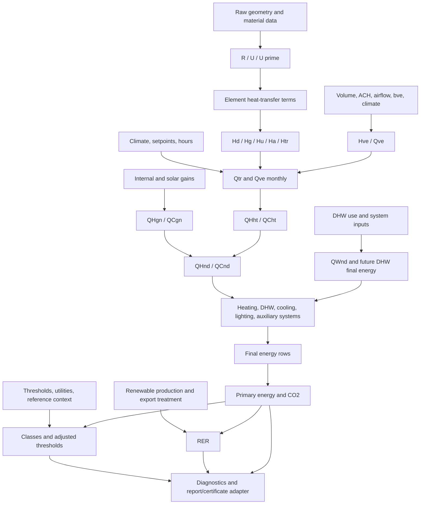

# INVESTIGATION 011 - Full MC001 Auditor Engine Architecture

## Status

- Investigation id: `INVESTIGATION_011_FULL_MC001_AUDITOR_ENGINE_ARCHITECTURE`
- Scope: architecture and design only.
- Code changes justified: no.
- Full MC001 auditor implementation justified in this task: no.
- Level 2 orchestrator implementation justified in this task: no.
- Production integration justified: no.

This investigation defines the target Physics Engine architecture for a complete MC001 auditor workflow. It does not implement new helpers, move files, change formulas, create migrations, update UI/API/Workers/DB schema, create report generation, create certificate/CPE workflow, or connect product data to MC001 validation.

## Files Inspected

| File or group | Reason inspected |
| --- | --- |
| `docs/mc001-validation/INVESTIGATION_009_LEVEL_1_EXPLICIT_INPUT_PACK.md` | Current explicit input-pack boundary and fail-closed section rules. |
| `docs/mc001-validation/FIXTURE_018_LEVEL_1_FAIL_CLOSED_HARDENING.md` | Current Level 1 hardening, required blockers, unit checks, and false readiness claims. |
| `docs/mc001-validation/GAP_ANALYSIS.md` | Current validated helpers, unresolved formulas, and remaining blocker set. |
| `docs/mc001-validation/VALIDATION_MATRIX.md` | Current fixture coverage, executable areas, and validation statuses. |
| `docs/mc001-validation/CANDIDATE_INVENTORY.md` | Current executable fixture inventory and blocked full examples. |
| `docs/mc001-extraction/19_extraction_registry.md` | Formula/table registry, missing-input vocabulary, and implementation readiness. |
| `src/physics-engine/mc001Level1CoreOrchestrator.mjs` | Current Level 1 orchestrator boundary, required sections, explicit blockers, and readiness flags. |
| `src/physics-engine/tests/validation/mc001ValidationCandidates.mjs` | Current validation candidate metadata and fixture limitation language. |
| `src/physics-engine/*` | Existing helper families and future migration targets. |

## Purpose

The target is a scalable MC001 Auditor Engine for an energy auditor, not a casual homeowner estimator and not a minimal product flow.

The future engine must transform:

1. auditor-entered raw technical data;
2. selected MC001/normative tables;
3. normalized and validated input packs;
4. derived coefficients;
5. envelope, ventilation, monthly balance, and system calculations;
6. final/primary/CO2 indicators;
7. classification, RER, diagnostics, blockers, and traceability;
8. report/certificate adapters only after all required domains are complete.

The architecture must preserve the current validation truth: isolated helpers and Level 1 explicit-input composition are validated in narrowed scopes, but no Level 2 full MC001 auditor is available yet.

## Architecture Principles

- The Physics Engine owns MC001 methodology, validation, calculation graph, blockers, and traceability.
- Adapters may translate DB/API/UI/report structures into audited input contracts later, but they must not invent MC001 values.
- Every calculation input must be explicit, unit-tagged, and source-traced before a helper call.
- Normative values must come from registries, not inline constants hidden inside orchestrators.
- Product estimates, fallback defaults, and user-friendly heuristics must not become MC001 validation inputs.
- Blocked or ambiguous methodology must be emitted as structured results, not hidden in prose.
- Certificate/CPE readiness may be claimed only when every required domain is complete, validated, and traceable.

## Auditor Workflow Coverage

| Workflow step | Target engine responsibility | Current status |
| --- | --- | --- |
| 1. Project/evaluation setup | Capture project metadata, evaluation purpose, date, boundary, auditor identity, and source pack version. | Design needed. |
| 2. Building classification | Use explicit category, occupancy/use, mixed-use declarations, and source mapping. | Explicit class/utility lookup exists; inference remains blocked. |
| 3. Geometry and thermal zones | Normalize auditor-entered dimensions, areas, volumes, zones, and conditioning boundaries. | Raw-to-engine builder missing. |
| 4. Envelope elements | Represent every element with area, contact type, orientation, zone link, and source trace. | Isolated fixtures exist for subsets. |
| 5. Opaque materials/layers | Calculate R/U/U prime only from explicit layer stacks and normative surface/material data. | Helpers exist for explicit values. |
| 6. Windows, doors, glazing | Represent openings, frame/glazing parameters, shading, orientation, and solar dependencies. | Full opening workflow blocked. |
| 7. Thermal bridges | Calculate explicit psi/length/chi or corrected-U paths without mixing methods. | Helpers exist for explicit rows; L2D path blocked without sourced values. |
| 8. Ground/subsoil/unconditioned spaces | Model ground, adjacent, basement, and unconditioned-zone transfer with explicit applicability. | Broader derivation blocked. |
| 9. Ventilation/infiltration | Calculate airflow, bve, Hve, and monthly Qve from explicit flows, volumes, and climate. | Narrow explicit helpers validated. |
| 10. Climate and indoor setpoints | Provide monthly/annual climate, solar, setpoints, schedules, and source confidence. | Official climate/solar registry blocked. |
| 11. Heating demand | Compose QH;ht, QH;gn, QH;nd with blocked Apr/Sep/Oct handling preserved. | Partial monthly summary validated. |
| 12. Heating system final energy | Convert useful demand to final energy only after explicit system efficiency/loss inputs exist. | Blocked. |
| 13. DHW useful and final energy | Calculate useful DHW and later full distribution/storage/generation/final paths. | Useful/display/component pieces exist; full final energy blocked. |
| 14. Cooling | Calculate useful and final cooling only with explicit demand and system performance. | Blocked. |
| 15. Lighting | Calculate lighting only after local SR EN 15193-1 dependent inputs are available. | Blocked external standard. |
| 16. Renewables | Calculate production, self-use/export, and renewable primary contribution from explicit systems and climate/solar data. | General methodology blocked. |
| 17. Final/primary/CO2 indicators | Aggregate explicit final-energy rows using reviewed factor registries. | Narrow helpers validated. |
| 18. RER | Compute general RER only after perimeter, renewables, export treatment, and factor basis are explicit. | Display-only reconciliation exists; general method blocked. |
| 19. Energy class assignment | Assign classes only from explicit table/category/indicator/threshold context. | Explicit interval lookup validated; certificate labels blocked. |
| 20. Reference building | Build reference comparison only after full reference parameter datasets are reviewed. | Blocked. |
| 21. Certificate/CPE/report outputs | Adapt complete, validated result graph into non-official/official output formats only when allowed. | Out of scope now. |
| 22. Audit trail and diagnostics | Emit value-level provenance, confidence, statuses, blockers, and helper traces. | Needed for Level 2. |
| 23. Real-case shadow validation | Run anonymized real cases only after the contract can represent them without invented values. | Blocked until contract exists. |
| 24. Future UI/API/DB adapters | Translate external data to the auditor input contract. | Future-only. |

## High-Level Engine Layers

| Layer | Responsibility | Allowed now | Must not do |
| --- | --- | --- | --- |
| `auditor-input-contract` | Define versioned schemas for auditor-entered raw data, source trace, assumptions, overrides, and blockers. | Design and later validation fixtures. | Infer missing technical data. |
| `normative-knowledge-base` | Store formulas, tables, symbols, units, applicability, source pages, versions, and confidence. | Registry design and hardening. | Hide normative constants in calculators. |
| `input-normalization-and-validation` | Convert raw auditor forms into typed, unit-checked, traceable calculation inputs. | Future fail-closed validators. | Use silent defaults or product fallbacks. |
| `derived-coefficients-engine` | Derive R, U, U prime, psi, bve, Hve, climate-normalized intermediates where fully sourced. | Existing helpers can migrate here or under domain folders. | Derive from missing geometry or assumed categories. |
| `thermal-envelope-engine` | Own envelope areas, opaque/opening transfer, bridges, ground, adjacent, unconditioned spaces, and Htr composition. | Existing explicit-input helper reuse. | Collapse blocked ground/bridge methods into defaults. |
| `ventilation-engine` | Own airflow, infiltration, mechanical ventilation, bve, Hve, Qve, and fan/AHU boundaries. | Existing explicit-input helper reuse. | Invent ACH, fan power, or AHU energy. |
| `monthly-balance-engine` | Own monthly Qtr, Qve, Qint, Qsol, utilization factors, QH;nd, QC;nd, and annual sums. | Existing explicit helper reuse with blockers. | Force Apr/Sep/Oct source conflicts into validated rows. |
| `service-systems-engine` | Own heating, DHW, cooling, lighting, auxiliary, generation, storage, distribution, and recovered-loss service paths. | Design only for blocked paths. | Promote useful demand to final energy. |
| `final-primary-co2-engine` | Own final-energy aggregation, factor lookup, primary split, CO2 conversion, and specific indicators. | Existing explicit helpers. | Use factors without reviewed source rows. |
| `classification-and-threshold-engine` | Own class thresholds, utility inclusion, optional utility recalculation, mixed-use rules, and class status. | Existing explicit class/threshold helpers. | Infer certificate class labels without full context. |
| `full-mc001-orchestrator` | Coordinate all domains over a complete audited input graph and return structured results/statuses. | Design only. | Implement Level 2 in this investigation. |
| `diagnostics-and-blockers` | Aggregate missing inputs, ambiguous methodology, external dependencies, and readiness claims. | Design and later structured helpers. | Hide blockers inside free text only. |
| `audit-trace/provenance` | Attach value-level formula/table/source/dependency metadata and confidence to every result. | Design and later wrappers. | Return bare numbers for official-like outputs. |
| `report/certificate-adapter` | Future transformation from complete engine result to report/CPE/certificate payloads. | Future-only. | Calculate methodology or fill missing fields. |
| `api/ui/db adapters` | Future translation between product storage/UI forms and the auditor input contract. | Future-only. | Bypass Physics Engine validation. |

## Data Ownership Model

| Major field group | Owner/source class | Examples | Rule |
| --- | --- | --- | --- |
| Project identifiers and evaluation metadata | auditor-entered | project id, evaluation date, address label, audit purpose, building boundary | Required for audit pack trace; no calculation from these fields alone. |
| Document/source references | auditor-entered or imported external dataset | drawing id, page, table row, photo id, facture id, measurement record | Mandatory when a value affects a helper call. |
| Building category and use | auditor-entered plus normative table selected | residential/non-residential category, education, hospital, mixed-use flags | Never infer from product labels. |
| Geometry and zones | auditor-entered or measured/override with source | areas, volumes, heights, zone boundaries, conditioned/unconditioned flags | Engine may normalize units, not invent dimensions. |
| Opaque material properties | selected from MC001/normative table or measured/override | lambda, correction coefficients, density if needed | Override requires material source and confidence. |
| Layer thickness and element assembly | auditor-entered or measured/override | layer thickness, order, air layers, Rsi/Rse | Missing layer data blocks derived R/U. |
| Openings/glazing | auditor-entered plus normative/manufacturer source | Uw, g-value, frame, area, shading, orientation | Manufacturer/measured values need mandatory source. |
| Bridge geometry and coefficients | auditor-entered, normative table selected, or calculated by engine | psi, length, chi, L2D, U prime | Do not mix corrected-U and explicit bridge paths silently. |
| Ground/unconditioned/adjacent coefficients | normative table selected or calculated by engine | Hg, Hu, Ha, bztu | Missing applicability must block, not default to zero. |
| Ventilation and infiltration inputs | auditor-entered, measured/override, or normative table selected | ACH, airflow, bve, fveDyn, rhoA, ca, fan data | Missing ACH/volume/fan source blocks relevant path. |
| Climate and solar values | imported external dataset or auditor-entered explicit values with warning | monthly thetae, annual thetae, irradiation, sky/longwave | Official-like mode requires reviewed dataset; explicit values remain traced. |
| Schedules and setpoints | auditor-entered or normative table selected | indoor temperature, operating hours, occupancy, DHW days | No schedule defaults without registry and applicability. |
| Monthly gains/utilization values | calculated by engine or auditor override with source | Qint, Qsol, gamma, eta | Overrides must be marked and cannot validate formula path. |
| Service systems | auditor-entered plus normative/manufacturer source | boiler, heat pump, district heat, distribution, storage, auxiliary | Missing performance or loss paths block final energy. |
| DHW quantities and system data | auditor-entered, normative table selected, or calculated by engine | service units, Tabel 3.3.1 row, temperatures, pipe geometry, storage/generation | Useful demand is not final energy. |
| Cooling systems | auditor-entered plus manufacturer/normative source | EER/SEER/COP, distribution, fan energy | Blocked until explicit useful demand and performance data exist. |
| Lighting systems | auditor-entered plus external standard data | installed power, schedule, control factors | Blocked until required SR EN 15193-1 data is available locally. |
| Renewables | auditor-entered plus climate/solar dataset | collector/PV parameters, orientation, production, export | Installed capacity alone is insufficient. |
| Final energy rows | calculated by service systems or measured/override with source | kWh/an by service and carrier | Measured/facture rows must not replace MC001 calculation unless marked as measured comparison. |
| Primary/CO2 factors | selected from MC001/normative table | Tabel 5.17, Tabel 5.18 rows | Factor key must match reviewed registry row. |
| Class thresholds and utilities | selected from MC001/normative table and calculated by engine | Tabel 5.6, 5.7-5.14, optional utility subtraction | Mixed-use and virtual utility paths remain blocked until extracted. |
| Expert overrides | measured/override with mandatory source | replacement U, measured airflow, adjusted schedule | Must carry override reason, source, approver, and confidence. |
| Assumptions and blockers | auditor-entered and calculated by diagnostics | missing source, blocked external standard, ambiguous example | Must remain visible in outputs. |

## Complete Auditor Input Contract

The future full auditor input pack should be versioned and serializable. Every top-level section must be present. A section can be `not_applicable` or `blocked`, but it must say so explicitly.

```js
{
  contractMetadata: {},
  projectMetadata: {},
  sourceTrace: {},
  buildingClassification: {},
  geometry: {},
  zones: [],
  envelopeElements: [],
  materialLayers: [],
  openings: [],
  thermalBridges: [],
  groundAndContactZones: {},
  unconditionedSpaces: [],
  ventilation: {},
  climateAndSetpoints: {},
  heatingSystems: [],
  dhwSystems: [],
  coolingSystems: [],
  lightingSystems: [],
  renewables: [],
  measuredConsumption: [],
  expertOverrides: [],
  assumptions: [],
  explicitBlockers: []
}
```

### Contract Metadata

| Field | Required | Type | Unit | Source requirement | Quality flag | Infer? | Fail-closed rule |
| --- | --- | --- | --- | --- | --- | --- | --- |
| `contractId` | yes | string | none | generated id with source pack | reviewed | no | Missing id blocks orchestration. |
| `contractVersion` | yes | string | none | engine contract registry | reviewed | no | Unknown version blocks orchestration. |
| `calculationMode` | yes | enum | none | auditor selection | reviewed | no | Must distinguish official-like, explicit-input, measured-comparison, and validation modes. |
| `targetMethodology` | yes | enum | none | `MC001-2022` or later registry | reviewed | no | Unsupported methodology version blocks all calculations. |
| `createdAt` | yes | date/time | ISO datetime | system timestamp | reviewed | no | Missing timestamp blocks audit trace. |
| `createdBy` | yes | string | none | auditor/account id | reviewed | no | Missing author blocks audit trace. |

### Project Metadata

| Field | Required | Type | Unit | Source requirement | Quality flag | Infer? | Fail-closed rule |
| --- | --- | --- | --- | --- | --- | --- | --- |
| `projectId` | yes | string | none | project record | reviewed | no | Missing project id blocks report/certificate adapters. |
| `evaluationPurpose` | yes | enum | none | auditor entry | reviewed | no | Unknown purpose blocks readiness claims. |
| `buildingAddressLabel` | optional for calculation, required for report adapter | string | none | auditor entry | reviewed | no | Missing address blocks report adapter only. |
| `evaluationDate` | yes | date | ISO date | auditor entry | reviewed | no | Missing date blocks normative version selection. |
| `auditorIdentity` | required for official workflow | object | none | auditor credential/source | reviewed | no | Missing identity blocks certificate/CPE adapter. |
| `auditBoundaryDescription` | yes | string | none | auditor entry and drawings | reviewed | no | Missing boundary blocks full-audit readiness. |

### Source Trace

| Field | Required | Type | Unit | Source requirement | Quality flag | Infer? | Fail-closed rule |
| --- | --- | --- | --- | --- | --- | --- | --- |
| `documents[]` | yes | array | none | uploaded/reference documents | reviewed/unreviewed | no | No source document blocks helper calls. |
| `documents[].documentId` | yes | string | none | stable id | reviewed | no | Missing id blocks dependent fields. |
| `documents[].type` | yes | enum | none | auditor entry | reviewed | no | Unknown source type lowers confidence or blocks official mode. |
| `documents[].pageRefs[]` | required when cited | array | pages | visual/source reference | reviewed | no | Helper-call values need page/table/formula references. |
| `fieldSources[]` | yes | array | none | field-to-source mapping | reviewed | no | Any numeric helper input without mapping blocks its domain. |
| `fieldSources[].quality` | yes | enum | none | reviewer flag | high/medium/low/blocked | no | Low quality may calculate only with warning; blocked cannot calculate. |

### Building Classification

| Field | Required | Type | Unit | Source requirement | Quality flag | Infer? | Fail-closed rule |
| --- | --- | --- | --- | --- | --- | --- | --- |
| `buildingUseCategories[]` | yes | array | none | auditor entry plus normative mapping | reviewed | no | Missing category blocks class/utility/reference paths. |
| `primaryCategoryKey` | yes | enum/string | none | reviewed category registry | reviewed | no | Unknown key blocks class and threshold lookup. |
| `occupancyType` | yes | enum/string | none | auditor entry | reviewed | no | Missing occupancy blocks schedules and DHW defaults. |
| `isResidential` | yes | boolean | none | auditor entry with mapping | reviewed | no | Cannot infer from label. |
| `mixedUseZones[]` | required if mixed-use | array | m2 or % | zone mapping | reviewed | no | Missing weights block mixed-use thresholds. |
| `certificateUtilityContext` | required for class workflow | object | none | MC001 Tabel 5.6 mapping | reviewed | no | Missing utility context blocks adjusted thresholds. |

### Geometry

| Field | Required | Type | Unit | Source requirement | Quality flag | Infer? | Fail-closed rule |
| --- | --- | --- | --- | --- | --- | --- | --- |
| `referenceArea` | yes for indicators | number | m2 | drawings/auditor measurement | reviewed | no | Missing area blocks specific indicators and classes. |
| `conditionedFloorArea` | yes | number | m2 | drawings/auditor measurement | reviewed | no | Missing area blocks envelope/system normalization. |
| `heatedVolume` | yes for ACH path | number | m3 | drawings/auditor measurement | reviewed | no | Missing volume blocks ACH airflow path. |
| `grossVolume` | optional | number | m3 | drawings/source | medium | no | Not used unless explicitly required. |
| `buildingPerimeter` | required for relevant formulas | number | m | drawings/source | reviewed | no | Missing perimeter blocks formulas that depend on it. |
| `storeyHeights[]` | required if volumes are derived | array | m | drawings/source | reviewed | no | Do not assume height from area. |
| `orientationReference` | required for solar/openings | enum/string | degrees or cardinal | drawing/source | reviewed | no | Missing orientation blocks solar/opening gains. |

### Zones

| Field | Required | Type | Unit | Source requirement | Quality flag | Infer? | Fail-closed rule |
| --- | --- | --- | --- | --- | --- | --- | --- |
| `zones[].zoneId` | yes | string | none | auditor entry | reviewed | no | Missing id blocks element links. |
| `zones[].conditioningStatus` | yes | enum | none | auditor entry | reviewed | no | Missing status blocks boundary classification. |
| `zones[].area` | yes | number | m2 | drawings/source | reviewed | no | Missing area blocks zone weighting. |
| `zones[].volume` | yes where ventilation uses volume | number | m3 | drawings/source | reviewed | no | Missing volume blocks zone ACH path. |
| `zones[].setpointProfileId` | yes for monthly balance | string | none | schedule/source | reviewed | no | Missing setpoint blocks monthly balance. |
| `zones[].useCategoryKey` | yes | enum/string | none | classification source | reviewed | no | Missing use blocks schedules/DHW/lighting. |
| `zones[].sourceRefs[]` | yes | array | none | source trace | reviewed | no | Missing source lowers or blocks domain confidence. |

### Envelope Elements

| Field | Required | Type | Unit | Source requirement | Quality flag | Infer? | Fail-closed rule |
| --- | --- | --- | --- | --- | --- | --- | --- |
| `elements[].elementId` | yes | string | none | auditor entry | reviewed | no | Missing id blocks trace. |
| `elements[].zoneId` | yes | string | none | zone contract | reviewed | no | Missing zone link blocks transfer grouping. |
| `elements[].elementType` | yes | enum | none | auditor entry | reviewed | no | Unknown type blocks normative applicability. |
| `elements[].contactType` | yes | enum | none | auditor entry | reviewed | no | Missing contact blocks Hd/Hg/Hu/Ha grouping. |
| `elements[].area` | yes | number | m2 | drawings/source | reviewed | no | Missing area blocks transmission. |
| `elements[].orientation` | required for solar/openings | enum/number | degrees/cardinal | drawings/source | reviewed | no | Missing orientation blocks solar gains. |
| `elements[].tilt` | required for solar/roof/opening | number | degrees | drawings/source | reviewed | no | Missing tilt blocks solar gains. |
| `elements[].calculationPath` | yes | enum | none | auditor/method selection | reviewed | no | Cannot mix `plain_u_with_bridges` and `corrected_u_prime` silently. |
| `elements[].uValue` | path-dependent | number | W/(m2K) | calculated or sourced | reviewed | no | Missing U blocks explicit bridge path. |
| `elements[].uPrimeValue` | path-dependent | number | W/(m2K) | calculated or sourced | reviewed | no | Missing U prime blocks corrected path. |

### Material Layers

| Field | Required | Type | Unit | Source requirement | Quality flag | Infer? | Fail-closed rule |
| --- | --- | --- | --- | --- | --- | --- | --- |
| `assemblies[].assemblyId` | yes | string | none | auditor entry | reviewed | no | Missing id blocks element link. |
| `assemblies[].elementIds[]` | yes | array | none | element ids | reviewed | no | Missing link blocks U calculation. |
| `layers[].layerId` | yes | string | none | auditor entry | reviewed | no | Missing id blocks trace. |
| `layers[].materialId` | yes | string | none | normative/material source | reviewed | no | Unknown material blocks registry lookup. |
| `layers[].thickness` | yes | number | m | drawing/site/source | reviewed | no | Missing thickness blocks R. |
| `layers[].lambdaNormat` | required for corrected lambda | number | W/(mK) | normative/material registry | reviewed | no | Missing lambda blocks corrected conductivity. |
| `layers[].lambdaUsed` | required for layer R | number | W/(mK) | calculated or sourced | reviewed | no | Missing lambda blocks R. |
| `layers[].correctionCoefficientA` | required when MC001 path needs it | number | none | Tabel 2.2 or source | reviewed | no | Missing coefficient blocks corrected lambda. |
| `assemblies[].rsi` | yes for total R | number | m2K/W | normative/source | reviewed | no | Missing Rsi blocks total R. |
| `assemblies[].rse` | yes for total R | number | m2K/W | normative/source | reviewed | no | Missing Rse blocks total R. |
| `assemblies[].airLayersR[]` | optional only if explicit | array | m2K/W | source/registry | reviewed | no | Missing applicability cannot default to empty without explicit not-applicable. |

### Openings

| Field | Required | Type | Unit | Source requirement | Quality flag | Infer? | Fail-closed rule |
| --- | --- | --- | --- | --- | --- | --- | --- |
| `openings[].openingId` | yes | string | none | auditor entry | reviewed | no | Missing id blocks trace. |
| `openings[].elementId` | yes | string | none | parent element | reviewed | no | Missing parent blocks area accounting. |
| `openings[].area` | yes | number | m2 | drawings/source | reviewed | no | Missing area blocks transmission and solar. |
| `openings[].uValue` | yes | number | W/(m2K) | manufacturer/normative/measured source | reviewed | no | Missing U blocks opening transmission. |
| `openings[].gValue` | required for solar gains | number | none | manufacturer/normative source | reviewed | no | Missing g-value blocks solar gain. |
| `openings[].frameFactor` | required for detailed solar/transmission | number | none | source | reviewed | no | Missing frame factor blocks detailed path. |
| `openings[].orientation` | yes for solar | enum/number | degrees/cardinal | drawings/source | reviewed | no | Missing orientation blocks solar gain. |
| `openings[].shadingFactors` | required for solar | object | none | source/registry | reviewed | no | Missing shading blocks solar gain. |
| `openings[].airLeakageClass` | optional/path-dependent | enum | none | manufacturer/source | medium | no | Missing class blocks only paths that require it. |

### Thermal Bridges

| Field | Required | Type | Unit | Source requirement | Quality flag | Infer? | Fail-closed rule |
| --- | --- | --- | --- | --- | --- | --- | --- |
| `bridges[].bridgeId` | yes | string | none | auditor entry | reviewed | no | Missing id blocks trace. |
| `bridges[].linkedElementIds[]` | yes | array | none | element ids | reviewed | no | Missing links block grouping. |
| `bridges[].bridgeType` | yes | enum | none | source/registry | reviewed | no | Unknown type blocks lookup. |
| `bridges[].psi` | required for linear bridge path | number | W/(mK) | source/registry/calculation | reviewed | no | Missing psi blocks explicit bridge path. |
| `bridges[].length` | required for linear bridge path | number | m | drawings/source | reviewed | no | Missing length blocks contribution. |
| `bridges[].chi` | required for point bridge path | number | W/K | source/registry | reviewed | no | Missing chi blocks point contribution. |
| `bridges[].l2d` | required for psi derivation path | number | W/K | simulation/source | reviewed | no | Missing L2D blocks psi derivation. |
| `bridges[].method` | yes | enum | none | auditor/method selection | reviewed | no | Mixed U prime and explicit bridge methods block. |

### Ground And Contact Zones

| Field | Required | Type | Unit | Source requirement | Quality flag | Infer? | Fail-closed rule |
| --- | --- | --- | --- | --- | --- | --- | --- |
| `groundContacts[].contactId` | required when ground applies | string | none | auditor entry | reviewed | no | Missing contact id blocks Hg path. |
| `groundContacts[].elementIds[]` | required when ground applies | array | none | element ids | reviewed | no | Missing link blocks Hg path. |
| `groundContacts[].groundModelType` | required when deriving Hg | enum | none | MC001/normative source | reviewed | no | Missing model blocks derivation. |
| `groundContacts[].hg` | required if using explicit coefficient | number | W/K | calculated or source | reviewed | no | Missing Hg while applicable blocks Htr. |
| `adjacentSpaces[].ha` | required if adjacent applies | number | W/K | calculated or source | reviewed | no | Missing Ha while applicable blocks Htr. |
| `applicability.hgApplicable` | yes | boolean | none | auditor/method source | reviewed | no | Missing applicability blocks Htr. |
| `applicability.huApplicable` | yes | boolean | none | auditor/method source | reviewed | no | Missing applicability blocks Htr. |
| `applicability.haApplicable` | yes | boolean | none | auditor/method source | reviewed | no | Missing applicability blocks Htr. |

### Unconditioned Spaces

| Field | Required | Type | Unit | Source requirement | Quality flag | Infer? | Fail-closed rule |
| --- | --- | --- | --- | --- | --- | --- | --- |
| `unconditionedSpaces[].spaceId` | required if any Hu/bztu path applies | string | none | auditor entry | reviewed | no | Missing id blocks Hu/bve path. |
| `unconditionedSpaces[].linkedZoneIds[]` | yes | array | none | zone ids | reviewed | no | Missing links block boundary allocation. |
| `unconditionedSpaces[].bztu` | required for bve from unconditioned zone | number | none | MC001/normative/source | reviewed | no | Missing bztu blocks bve path. |
| `unconditionedSpaces[].hu` | required if using explicit Hu | number | W/K | calculated or source | reviewed | no | Missing Hu while applicable blocks Htr. |
| `unconditionedSpaces[].sourceRefs[]` | yes | array | none | source trace | reviewed | no | Missing source blocks official-like mode. |

### Ventilation

| Field | Required | Type | Unit | Source requirement | Quality flag | Infer? | Fail-closed rule |
| --- | --- | --- | --- | --- | --- | --- | --- |
| `ventilation.mode` | yes | enum | none | auditor/method selection | reviewed | no | Unknown mode blocks ventilation. |
| `flows[].zoneId` | yes | string | none | zone id | reviewed | no | Missing zone blocks aggregation. |
| `flows[].airflowM3h` | required for airflow path | number | m3/h | design/source/measurement | reviewed | no | Missing flow blocks Hve. |
| `flows[].airflowM3s` | alternative to m3/h | number | m3/s | design/source/measurement | reviewed | no | Both m3/h and m3/s in same row block. |
| `flows[].ach` | required for ACH path | number | 1/h | source/measurement | reviewed | no | Missing ACH blocks ACH path. |
| `flows[].volume` | required for ACH path | number | m3 | geometry/source | reviewed | no | Missing volume blocks ACH path. |
| `flows[].bve` | yes for Hve | number | none | calculated/source | reviewed | no | Missing bve blocks Hve. |
| `flows[].fveDyn` | path-dependent | number | none | source/registry | reviewed | no | Missing fveDyn blocks paths requiring it. |
| `rhoA` | required for full Hve | number | kg/m3 | source/registry | reviewed | no | Missing rhoA blocks full Hve. |
| `ca` | required for full Hve | number | J/(kgK) | source/registry | reviewed | no | Missing ca blocks full Hve. |
| `monthlyRows[].thetaExternal` | yes for Qve | number | degC | climate source | reviewed | no | Missing monthly climate blocks Qve. |
| `monthlyRows[].deltaHours` | yes for Qve | number | h | calendar/schedule source | reviewed | no | Missing hours blocks Qve. |
| `fanOrAhuEnergy` | optional/path-dependent | object | kWh/an or inputs | equipment/source | blocked/low until extracted | no | Missing fan data blocks auxiliary ventilation energy. |

### Climate And Setpoints

| Field | Required | Type | Unit | Source requirement | Quality flag | Infer? | Fail-closed rule |
| --- | --- | --- | --- | --- | --- | --- | --- |
| `climateSourceId` | yes for monthly methods | string | none | reviewed climate dataset or explicit source | reviewed/explicit_with_warning | no | Missing source blocks official-like monthly mode. |
| `monthlyExteriorTemperatures[]` | yes for monthly transfer | 12 numbers | degC | climate dataset/source | reviewed | no | Missing month blocks monthly transfer. |
| `annualExteriorTemperature` | path-dependent | number | degC | climate dataset/source | reviewed | no | Missing annual value blocks ground monthly transfer. |
| `monthlySolarIrradiation[]` | required for solar gains/renewables | array | kWh/m2 or source unit | climate/solar dataset | reviewed | no | Missing solar blocks solar gains and renewable production. |
| `skyLongwaveTerms` | path-dependent | object | source units | climate/solar dataset | reviewed | no | Missing terms block paths requiring them. |
| `indoorSetpoints[]` | yes for monthly balance | array | degC | auditor/normative schedule | reviewed | no | Missing setpoint blocks heat transfer. |
| `operatingSchedules[]` | required for gains/lighting/DHW | array | h, days, fractions | auditor/normative schedule | reviewed | no | Missing schedule blocks relevant domains. |

### Heating Systems

| Field | Required | Type | Unit | Source requirement | Quality flag | Infer? | Fail-closed rule |
| --- | --- | --- | --- | --- | --- | --- | --- |
| `heatingSystems[].systemId` | required if heating service applies | string | none | auditor entry | reviewed | no | Missing id blocks final heating path. |
| `heatingSystems[].servedZoneIds[]` | yes | array | none | zone ids | reviewed | no | Missing served zones blocks allocation. |
| `heatingSystems[].carrierKey` | yes for final/primary | string | none | reviewed factor registry | reviewed | no | Missing carrier blocks factors. |
| `heatingSystems[].usefulDemandSource` | yes | enum/object | kWh/an | calculated QH;nd or explicit source | reviewed | no | Missing useful demand blocks final heating. |
| `heatingSystems[].generationEfficiency` | path-dependent | number | none | equipment/source/registry | reviewed | no | Missing efficiency blocks final heating path. |
| `heatingSystems[].distributionLosses` | path-dependent | object | kWh/an or inputs | source/registry | reviewed | no | Missing losses block paths requiring them. |
| `heatingSystems[].storageLosses` | path-dependent | object | kWh/an or inputs | source/registry | reviewed | no | Missing storage data blocks paths requiring it. |
| `heatingSystems[].auxiliaryEnergy` | path-dependent | object | kWh/an or inputs | source/registry | reviewed | no | Missing auxiliary source blocks auxiliary row. |

### DHW Systems

| Field | Required | Type | Unit | Source requirement | Quality flag | Infer? | Fail-closed rule |
| --- | --- | --- | --- | --- | --- | --- | --- |
| `dhwSystems[].systemId` | required if DHW applies | string | none | auditor entry | reviewed | no | Missing id blocks DHW. |
| `dhwSystems[].serviceUnits` | required for non-residential demand | number | unit-specific | auditor/source | reviewed | no | Missing unit count blocks Tabel 3.3.1 path. |
| `dhwSystems[].table3_3_1EntryId` | required for table path | string | none | reviewed registry | reviewed | no | Missing row blocks table-backed volume. |
| `dhwSystems[].dailyVolume` | path-dependent | number | l/day | calculated or sourced | reviewed | no | Missing volume blocks useful demand. |
| `dhwSystems[].thetaHot` | yes for useful demand | number | degC | source/normative | reviewed | no | Missing hot temp blocks useful demand. |
| `dhwSystems[].thetaCold` | yes for useful demand | number | degC | source/normative | reviewed | no | Missing cold temp blocks useful demand. |
| `dhwSystems[].pipeGeometry` | required for distribution components | object | m | drawings/source | reviewed | no | Missing geometry blocks pipe formulas. |
| `dhwSystems[].distributionOperatingBasis` | required for annual distribution loss | object | h, m, K | source/registry | blocked until resolved | no | Missing basis blocks annual DHW distribution energy. |
| `dhwSystems[].storageInputs` | path-dependent | object | source units | equipment/source | blocked | no | Missing storage inputs block full DHW final energy. |
| `dhwSystems[].generationInputs` | path-dependent | object | source units | equipment/source | blocked | no | Missing generation inputs block full DHW final energy. |
| `dhwSystems[].recoveredLossInputs` | path-dependent | object | kWh/an or inputs | source | blocked | no | Missing recovery source blocks recovered-loss credit. |
| `dhwSystems[].auxiliaryEnergy` | path-dependent | object | kWh/an or inputs | source | blocked | no | Missing auxiliary source blocks auxiliary row. |

### Cooling Systems

| Field | Required | Type | Unit | Source requirement | Quality flag | Infer? | Fail-closed rule |
| --- | --- | --- | --- | --- | --- | --- | --- |
| `coolingSystems[].systemId` | required if cooling applies | string | none | auditor entry | reviewed | no | Missing id blocks cooling. |
| `coolingSystems[].servedZoneIds[]` | yes | array | none | zone ids | reviewed | no | Missing zones blocks allocation. |
| `coolingSystems[].usefulCoolingDemand` | required for final cooling | number | kWh/an | calculated or sourced | reviewed | no | Missing demand blocks final cooling. |
| `coolingSystems[].performanceMetric` | required for final cooling | enum | none | equipment/source | reviewed | no | Missing metric blocks final cooling. |
| `coolingSystems[].performanceValue` | required for final cooling | number | EER/SEER/COP units | equipment/source | reviewed | no | Missing value blocks final cooling. |
| `coolingSystems[].auxiliaryEnergy` | path-dependent | object | kWh/an or inputs | source | reviewed | no | Missing auxiliary source blocks auxiliary row. |
| `coolingSystems[].distributionLosses` | path-dependent | object | kWh/an or inputs | source | reviewed | no | Missing losses block paths requiring them. |

### Lighting Systems

| Field | Required | Type | Unit | Source requirement | Quality flag | Infer? | Fail-closed rule |
| --- | --- | --- | --- | --- | --- | --- | --- |
| `lightingSystems[].systemId` | required if lighting applies | string | none | auditor entry | reviewed | no | Missing id blocks lighting. |
| `lightingSystems[].servedZoneIds[]` | yes | array | none | zone ids | reviewed | no | Missing zones blocks allocation. |
| `lightingSystems[].installedPower` | required for lighting energy | number | W | source/measurement | reviewed | no | Missing power blocks lighting. |
| `lightingSystems[].schedule` | required for lighting energy | object | h, days, fractions | auditor/source | reviewed | no | Missing schedule blocks lighting. |
| `lightingSystems[].controlFactors` | path-dependent | object | none | SR EN/normative source | blocked_external_standard | no | Missing external-standard data blocks lighting. |
| `lightingSystems[].daylightFactors` | path-dependent | object | none | source/standard | blocked_external_standard | no | Missing daylight data blocks lighting. |

### Renewables

| Field | Required | Type | Unit | Source requirement | Quality flag | Infer? | Fail-closed rule |
| --- | --- | --- | --- | --- | --- | --- | --- |
| `renewables[].systemId` | required if renewables apply | string | none | auditor entry | reviewed | no | Missing id blocks renewable contribution. |
| `renewables[].type` | yes | enum | none | auditor entry | reviewed | no | Unknown type blocks production path. |
| `renewables[].carrierOrUse` | yes | enum/string | none | service mapping | reviewed | no | Missing mapping blocks RER/final row. |
| `renewables[].installedCapacity` | path-dependent | number | kW, m2, or source unit | source/equipment | reviewed | no | Capacity alone cannot calculate production. |
| `renewables[].orientation` | required for solar/PV/thermal | number/enum | degrees/cardinal | drawing/source | reviewed | no | Missing orientation blocks solar production. |
| `renewables[].tilt` | required for solar/PV/thermal | number | degrees | drawing/source | reviewed | no | Missing tilt blocks solar production. |
| `renewables[].monthlyProduction` | optional explicit | array | kWh/month | measured/source/calculated | reviewed | no | If used, must be marked measured or calculated. |
| `renewables[].exportTreatment` | required for RER/export | enum/object | none | methodology/source | blocked until resolved | no | Missing export treatment blocks general RER. |

### Measured Consumption And Factures

| Field | Required | Type | Unit | Source requirement | Quality flag | Infer? | Fail-closed rule |
| --- | --- | --- | --- | --- | --- | --- | --- |
| `measuredConsumption[].recordId` | optional for calculations, required for measured comparison | string | none | facture/meter id | reviewed | no | Missing record id blocks measured comparison. |
| `measuredConsumption[].periodStart` | yes if row exists | date | ISO date | facture/meter | reviewed | no | Missing period blocks normalization. |
| `measuredConsumption[].periodEnd` | yes if row exists | date | ISO date | facture/meter | reviewed | no | Missing period blocks normalization. |
| `measuredConsumption[].carrierKey` | yes if row exists | string | none | facture/meter | reviewed | no | Missing carrier blocks comparison. |
| `measuredConsumption[].quantity` | yes if row exists | number | kWh or billing unit | facture/meter | reviewed | no | Missing quantity blocks comparison. |
| `measuredConsumption[].conversionToKWh` | required when source is not kWh | object | factor/source | facture/normative source | reviewed | no | Missing conversion blocks comparison. |
| `measuredConsumption[].useInMc001Calculation` | yes | boolean | none | auditor decision | reviewed | no | Must default false; measured rows cannot silently replace MC001 calculations. |

### Expert Overrides

| Field | Required | Type | Unit | Source requirement | Quality flag | Infer? | Fail-closed rule |
| --- | --- | --- | --- | --- | --- | --- | --- |
| `expertOverrides[].overrideId` | yes if row exists | string | none | auditor entry | reviewed | no | Missing id blocks override. |
| `expertOverrides[].targetFieldPath` | yes | string | none | input/result path | reviewed | no | Missing target blocks override. |
| `expertOverrides[].value` | yes | any typed value | target unit | source/measurement | reviewed | no | Missing value blocks override. |
| `expertOverrides[].unit` | required for numeric value | string | target unit | source | reviewed | no | Unit mismatch blocks override. |
| `expertOverrides[].reason` | yes | string | none | auditor note | reviewed | no | Missing reason blocks override. |
| `expertOverrides[].sourceRefs[]` | yes | array | none | document/measurement refs | reviewed | no | Missing source blocks override. |
| `expertOverrides[].approvedBy` | required for official workflow | string | none | auditor credential | reviewed | no | Missing approval blocks certificate adapter. |

### Assumptions

| Field | Required | Type | Unit | Source requirement | Quality flag | Infer? | Fail-closed rule |
| --- | --- | --- | --- | --- | --- | --- | --- |
| `assumptions[].assumptionId` | yes if row exists | string | none | auditor entry | reviewed | no | Missing id blocks trace. |
| `assumptions[].area` | yes | enum/string | none | domain reference | reviewed | no | Missing area blocks diagnostics. |
| `assumptions[].description` | yes | string | none | auditor note | reviewed | no | Missing description blocks readiness. |
| `assumptions[].sourceRefs[]` | required if assumption affects calculation | array | none | source trace | reviewed | no | Missing source blocks helper path. |
| `assumptions[].calculationImpact` | yes | enum | none | auditor/engine | reviewed | no | Unknown impact blocks readiness. |

### Explicit Blockers

| Field | Required | Type | Unit | Source requirement | Quality flag | Infer? | Fail-closed rule |
| --- | --- | --- | --- | --- | --- | --- | --- |
| `explicitBlockers[].blockerId` | yes if blocker exists | string | none | registry/id | reviewed | no | Missing blocker id blocks diagnostics. |
| `explicitBlockers[].area` | yes | enum/string | none | domain | reviewed | no | Missing area blocks grouping. |
| `explicitBlockers[].status` | yes | status enum | none | blocker registry | reviewed | no | Unknown status blocks readiness. |
| `explicitBlockers[].reason` | yes | string | none | investigation/source note | reviewed | no | Missing reason blocks readiness. |
| `explicitBlockers[].sourceRefs[]` | yes | array | none | docs/source refs | reviewed | no | Missing source blocks readiness. |
| `explicitBlockers[].blocksReadiness` | yes | boolean | none | engine diagnostics | reviewed | no | Missing readiness impact blocks certificate readiness. |

## Normative Knowledge Base Model

The normative knowledge base should be a versioned data layer. Calculators should request formulas, tables, symbols, factors, statuses, and applicability from this layer.

| Registry | Required fields | Purpose |
| --- | --- | --- |
| `formulaRegistry` | `formulaId`, `methodologyVersion`, `reference`, `section`, `pageRefs`, `symbolInputs`, `outputSymbol`, `unit`, `applicabilityRuleIds`, `implementationStatus`, `confidence`, `blockedReason` | Identifies callable formulas and blocked formulas without hiding source uncertainty. |
| `tableRegistry` | `tableId`, `title`, `methodologyVersion`, `pageRefs`, `rowKeySchema`, `columnSchema`, `unitSchema`, `version`, `confidence`, `sourceReviewStatus` | Stores MC001 tables and lookup metadata. |
| `symbolRegistry` | `symbol`, `name`, `canonicalUnit`, `allowedUnits`, `domain`, `description`, `sourceRefs` | Prevents symbol/unit drift across modules. |
| `unitRegistry` | `unit`, `dimension`, `conversionRules`, `conversionAllowed`, `precisionPolicy` | Allows explicit unit conversion only where reviewed. |
| `applicabilityRegistry` | `ruleId`, `domain`, `predicateInputs`, `allowedStatuses`, `sourceRefs`, `blockedFallback` | Decides whether a formula/table can be used for a requested case. |
| `factorRegistry` | `factorId`, `carrierKey`, `serviceScope`, `renewableFactor`, `nonRenewableFactor`, `totalFactor`, `co2Factor`, `sourceTable`, `version` | Owns Tabel 5.17/5.18 style factors. |
| `climateSolarRegistry` | `locationKey`, `month`, `thetaExternal`, `thetaAnnual`, `irradiationByOrientation`, `sourceVersion`, `confidence` | Future official-like climate/solar inputs. |
| `blockedExternalStandardsRegistry` | `standardId`, `domain`, `neededFields`, `currentStatus`, `resolutionRequirement` | Tracks lighting and other externally referenced methods. |

Minimum normative record shape:

```js
{
  id: "MC001_2_15_HTR_TOTAL",
  methodologyVersion: "MC001-2022",
  source: {
    document: "MC001-2022",
    section: "2.4.1",
    pages: [],
    table: null,
    relation: "2.15"
  },
  inputs: [
    { symbol: "Hd", unit: "W/K", required: true },
    { symbol: "Hg", unit: "W/K", required: true }
  ],
  output: { symbol: "Htr", unit: "W/K" },
  applicability: [],
  status: "validated",
  confidence: "reviewed",
  missingInputsBehavior: "blocked_missing_input"
}
```

Blocked or missing external standards must be first-class registry records. They must not be represented as absent data that later code can accidentally default around.

## Calculation Dependency Graph



Text form:

1. `geometry/materials -> R/U/U prime`.
2. `U/areas/bridges -> Hd/Hg/Hu/Ha/Htr`.
3. `volume/ACH/debits/climate -> Hve/Qve`.
4. `Htr/Hve/climate/gains -> QH;ht/QH;gn/QH;nd`.
5. `DHW inputs -> QW;nd and later final DHW energy`.
6. `service systems -> final energy rows`.
7. `final energy + factors -> primary/CO2`.
8. `primary/CO2 + thresholds -> classes`.
9. `renewable contributions -> RER`.
10. `all results -> diagnostics/report adapter`.

## Provenance And Audit Trail Model

Every derived value should be returned as a traceable value object unless it is inside a private low-level helper. Orchestrator-level outputs should never expose bare numbers without trace.

| Field | Required | Meaning |
| --- | --- | --- |
| `value` | yes when calculated | Numeric, string, enum, object, or null. |
| `unit` | yes for numeric values | Canonical output unit. |
| `symbol` | yes for methodology outputs | MC001 symbol or engine-defined symbol. |
| `formulaId` | yes for calculated values | Formula registry id. |
| `sourceTableId` | yes when table-backed | Normative table/factor row id. |
| `sourceFormulaId` | yes when formula-backed | Normative formula id, if different from helper id. |
| `inputDependencies[]` | yes | Field paths and result ids consumed by this value. |
| `calculationStatus` | yes | Status model value. |
| `confidence` | yes | `reviewed`, `medium`, `low`, `blocked`, or domain-specific flag. |
| `blocker` | required when not calculated | Structured blocker id and reason. |
| `overrideSource` | required for manual overrides | Source refs, approver, and reason. |
| `precisionPolicy` | yes for rounded/display values | Internal precision, displayed precision, tolerance. |
| `helperTrace` | yes for helper calls | Helper name, input summary, output status. |

Example result shape:

```js
{
  resultId: "transmission.Htr",
  value: 512.34,
  unit: "W/K",
  symbol: "Htr",
  formulaId: "MC001_2_15_HTR_TOTAL",
  sourceTableId: null,
  inputDependencies: [
    "transmission.Hd",
    "transmission.Hg",
    "transmission.Hu",
    "transmission.Ha"
  ],
  calculationStatus: "calculated",
  confidence: "reviewed",
  blocker: null,
  overrideSource: null,
  precisionPolicy: {
    internalDecimals: 6,
    displayDecimals: 2
  }
}
```

## Status Model

| Status | Meaning | Readiness impact |
| --- | --- | --- |
| `validated` | Result matches a reviewed fixture or reviewed dataset rule. | Can support validated fixture claims. |
| `calculated` | Result is calculated from explicit inputs and registered formulas, but not necessarily tied to a fixture expected value. | Can support engine output if dependencies are complete. |
| `display_reconciliation_only` | Arithmetic matches a displayed source value but does not validate general methodology. | Cannot be promoted to methodology validation. |
| `blocked_missing_input` | Required auditor, source, or calculated input is missing. | Blocks relevant domain. |
| `blocked_missing_normative_data` | Required MC001/normative table, factor, climate, solar, or parameter registry is absent. | Blocks relevant domain. |
| `blocked_external_standard` | Required method/data belongs to an external standard not locally extracted. | Blocks relevant domain. |
| `ambiguous_mc001_example` | Source example conflicts with formula branch, display, or surrounding source rows. | Blocks strict validation. |
| `requires_expert_override` | Calculation needs an auditor-sourced override before proceeding. | Blocks automatic calculation. |
| `not_applicable` | Domain does not apply based on explicit context. | Does not block if applicability is sourced. |
| `out_of_scope_current_phase` | Domain is intentionally excluded from the current implementation phase. | Blocks full-audit/certificate readiness. |

## Global Fail-Closed Policy

The full engine must fail closed when:

- a required section is missing;
- a required field is missing, null, blank, non-finite, or in the wrong unit;
- a numeric input is a string;
- a helper input lacks source trace;
- a normative lookup key is unknown;
- a source table/formula version is missing;
- an override lacks source, reason, unit, or approver where required;
- a category is inferred from a product label rather than mapped by a reviewed registry;
- a product estimate or fallback is passed as MC001 validation input;
- a blocked domain is omitted from diagnostics;
- a display-only reconciliation is used as general methodology validation;
- a class/certificate/RER result is requested while reference, utility, mixed-use, overheating, or perimeter context is missing;
- certificate/CPE readiness is claimed while any required domain is incomplete, blocked, ambiguous, or out of scope.

Global forbidden behavior:

- no invented values;
- no silent defaults;
- no unit mismatch;
- no missing source for overrides;
- no category inference without mapping;
- no product estimates as MC001 validation inputs;
- no hiding blocked methodology;
- no certificate readiness claim unless all required domains are complete.

## Known Blockers That Must Remain Explicit

| Blocker | Status |
| --- | --- |
| April boundary heating-period method | `ambiguous_mc001_example` / `blocked_missing_normative_data` until resolved. |
| September boundary heating-period method | `ambiguous_mc001_example` / `blocked_missing_normative_data` until resolved. |
| October MC001 worked-example ambiguity | `ambiguous_mc001_example`. |
| Full DHW final-energy chain | `blocked_missing_input`. |
| Annual DHW distribution-loss basis | `blocked_missing_input` / `ambiguous_mc001_example`. |
| Storage/generation/recovered/auxiliary DHW paths | `blocked_missing_input`. |
| General RER methodology and perimeter/export treatment | `blocked_missing_normative_data`. |
| Anexa B CO2 display inconsistency | `ambiguous_mc001_example`. |
| Anexa B displayed class labels | `blocked_missing_input`. |
| Mixed-use weighted thresholds | `blocked_missing_normative_data`. |
| Overheating/discomfort hours above 26 degC | `blocked_missing_input`. |
| Virtual ventilation full calculation | `blocked_missing_input`. |
| Lighting | `blocked_external_standard`. |
| Cooling systems | `blocked_missing_input`. |
| Reference building | `blocked_missing_normative_data`. |
| Certificate/CPE generation | `out_of_scope_current_phase`. |
| Climate/solar official dataset | `blocked_missing_normative_data`. |
| Economic audit formulas | `blocked_missing_normative_data` / `ambiguous_mc001_example`. |

## Scalability And Module Boundaries

Future folder direction under `src/physics-engine`:

| Future folder | Responsibility | Existing modules likely to migrate or be wrapped |
| --- | --- | --- |
| `input-contract/` | Versioned full-auditor schema, section validators, allowed status/quality vocabularies. | New only. |
| `normative/` | Formula/table/symbol/unit/applicability registries and lookup APIs. | Existing `datasets/*` plus extraction-derived registries. |
| `envelope/` | Materials, layer R/U/U prime, element transmission, envelope requirements. | `materialsUValues.mjs`, `envelopeRequirementChecks.mjs`. |
| `bridges/` | Linear/point bridges, L2D-derived psi, bridge grouping, corrected-U boundaries. | Bridge portions of `transmissionCoefficients.mjs`. |
| `ground/` | Ground, adjacent, unconditioned, basement, and contact-zone models. | Future wrappers around Htr/Hg/Hu/Ha paths. |
| `ventilation/` | ACH/airflow, bve, Hve, Qve, ventilation auxiliary boundaries. | `ventilationCoefficients.mjs`. |
| `monthly-balance/` | Monthly transmission/ventilation transfer, gains, heating/cooling needs, annual sums. | `monthlyTransmissionTransfer.mjs`, `monthlyBalance.mjs`. |
| `systems/heating/` | Heating final-energy service paths, generation/distribution/storage/auxiliary. | New only. |
| `systems/dhw/` | DHW useful demand, distribution components, final-energy chain, storage/generation/recovery. | `dhwUsefulDemand.mjs`, `dhwDistributionLosses.mjs`. |
| `systems/cooling/` | Cooling useful/final energy and system performance. | New only. |
| `systems/lighting/` | Lighting calculation once external-standard inputs are available. | New only. |
| `renewables/` | Renewable production, self-use/export, renewable primary/RER inputs. | New only. |
| `indicators/` | Final, primary, CO2, specific indicators, factor application. | `finalPrimaryCo2Indicators.mjs`. |
| `classes/` | Energy/environmental class assignment, utility inclusion, threshold adjustment. | `energyClassAssignment.mjs`, `utilityInclusionThresholds.mjs`. |
| `orchestrators/` | Level 0, Level 1, and future Level 2 full-auditor orchestration. | `minimalMc001OrchestratorSummary.mjs`, `mc001Level1CoreOrchestrator.mjs`. |
| `diagnostics/` | Blockers, missing-input aggregation, readiness decisions, status rollups. | New wrappers around current blocker arrays. |
| `provenance/` | Value objects, source trace, helper trace, override trace, audit graph. | New only. |
| `tests/validation/` | Reviewed fixtures, investigations, and validation candidates. | Existing validation tests remain. |

No file movement is recommended in this investigation. Migration should happen only when a future implementation phase has tests protecting behavior.

## Migration Strategy From Current Engine

| Current module | Future location | Current validation status | Blockers | Reuse as-is | Adapter/wrapper | Refactor later |
| --- | --- | --- | --- | --- | --- | --- |
| `materialsUValues.mjs` | `envelope/materialsUValues.mjs` | Fixtures 001 and 003 validate explicit subsets. | Remaining rows and surface-resistance context. | yes | yes for provenance/value objects | possible namespace move later |
| `transmissionCoefficients.mjs` | `envelope/transmissionCoefficients.mjs`, `bridges/`, `ground/` | Fixtures 001-004 validate explicit paths and totals. | L2D psi, broader ground derivation, mixed method boundaries. | yes | yes | split by domain later |
| `monthlyTransmissionTransfer.mjs` | `monthly-balance/monthlyTransmissionTransfer.mjs` | Helper exists; no executable full fixture. | Climate/annual exterior temperature and ground intermediates. | yes | yes | after climate registry |
| `ventilationCoefficients.mjs` | `ventilation/ventilationCoefficients.mjs` | Fixture 005 validates explicit Hve/Qve rows. | ACH source, independent constants, fan/AHU energy. | yes | yes | split heat transfer from auxiliary later |
| `monthlyBalance.mjs` | `monthly-balance/monthlyBalance.mjs` | Fixture 006 and Fixture 017 validate partial monthly paths. | Apr/Sep/Oct, exact eta, full gains/climate chain. | yes | yes | add provenance wrappers later |
| `finalPrimaryCo2Indicators.mjs` | `indicators/finalPrimaryCo2Indicators.mjs` | Fixtures 007, 008, 016 validate explicit final/primary/CO2 paths. | Broader service rows, display conflicts, certificate context. | yes | yes | factor lookup through normative layer later |
| `dhwUsefulDemand.mjs` | `systems/dhw/usefulDemand.mjs` | Fixture 010 validates useful-demand chain. | Full DHW final energy and system losses. | yes | yes | compose into DHW service engine later |
| `dhwDistributionLosses.mjs` | `systems/dhw/distributionComponents.mjs` | Fixture 009 validates component formulas. | Annual distribution-loss basis and scale conflict. | yes | yes | add annual paths only after blockers resolved |
| `energyClassAssignment.mjs` | `classes/energyClassAssignment.mjs` | Fixture 013 validates explicit interval lookup. | Anexa B labels, reference building, CPE context. | yes | yes | normative lookup API later |
| `utilityInclusionThresholds.mjs` | `classes/utilityInclusionThresholds.mjs` | Fixture 014 validates Tabel 5.6 and Nota 4 explicit adjustment. | Mixed-use, virtual utility, overheating context. | yes | yes | integrate with class workflow later |
| `envelopeRequirementChecks.mjs` | `envelope/requirements.mjs` | Isolated helper tests exist. | Broader worked example rows. | yes | yes | connect to normative threshold registry later |
| `minimalMc001OrchestratorSummary.mjs` | `orchestrators/level0Summary.mjs` | Fixture 015 validates Level 0 summary. | Not a calculator. | yes | optional | keep as summary |
| `mc001Level1CoreOrchestrator.mjs` | `orchestrators/level1Core.mjs` | Fixtures 016-018 validate narrow explicit core and fail-closed behavior. | Not Level 2, no full input builder, many domains blocked. | yes | yes | replace with full graph orchestrator later |
| `datasets/mc001PrimaryEnergyAndCO2Factors.mjs` | `normative/factors/primaryCo2.mjs` | Reviewed factor registry used by fixtures. | Versioned registry API missing. | yes | yes | normalize with table registry later |
| `datasets/mc001EnergyClassThresholds.mjs` | `normative/classes/thresholds.mjs` | Fixture 013 validates thresholds. | Certificate class workflow blocked. | yes | yes | integrate utility/mixed-use later |
| `datasets/mc001DhwDemandTable3_3_1.mjs` | `normative/dhw/table3_3_1.mjs` | Fixture 010 validates selected row. | Broader DHW final energy blocked. | yes | yes | normalize row metadata later |
| `datasets/mc001EnvelopeThresholds.mjs` | `normative/envelope/thresholds.mjs` | Dataset tests exist. | Worked example checks limited. | yes | yes | normalize table registry later |
| `tests/validation/*` | `tests/validation/*` | Eighteen executable narrowed fixtures. | Full examples still blocked. | yes | no | extend incrementally |

## Full Engine Roadmap

| Phase | Name | Goal | Exit criteria |
| --- | --- | --- | --- |
| A | Architecture and input contract | Finalize full auditor contract, status vocabulary, provenance shape, and fail-closed policy. | Reviewed architecture doc and schema fixture. |
| B | Normative knowledge base hardening | Move table/formula metadata into versioned registries. | Formula/table/symbol/unit registries with tests. |
| C | Auditor input builder | Convert raw auditor data into explicit typed input packs. | Negative tests prove no inferred defaults. |
| D | Envelope from raw data | Calculate R/U/U prime, bridges, ground/contact, and Htr from raw assemblies. | Fixture-backed envelope graph with provenance. |
| E | Ventilation from raw data | Calculate airflow, bve, Hve, Qve, and blocked fan/AHU boundaries. | Full explicit ventilation graph with blockers. |
| F | Monthly heating/cooling/gains | Add climate/gains registries and monthly demand graph. | Apr/Sep/Oct blockers resolved or preserved with tests. |
| G | Service systems | Implement heating service final-energy paths from explicit systems. | Final rows produced from traced useful-demand/system inputs. |
| H | DHW full final energy | Resolve annual distribution/storage/generation/recovery/auxiliary paths. | DHW final energy fixture validates full chain or remains blocked. |
| I | Lighting/cooling/renewables | Add reviewed lighting, cooling, and renewable production paths. | External-standard and climate blockers resolved with registries. |
| J | Full orchestrator | Implement Level 2 full MC001 auditor orchestrator over all domains. | Complete audited input pack produces structured result graph. |
| K | Real-case shadow validation | Run anonymized real DB cases through the contract. | Shadow cases identify data gaps without product fallback promotion. |
| L | DB/API/UI adapters | Map product storage and auditor UI to/from the input contract. | Adapters pass allowlist and cannot bypass fail-closed validators. |
| M | Report/CPE/certificate | Build output adapters after full methodology readiness. | Certificate/report payload generated only from complete result graph. |

## Acceptance Criteria Before Starting Level 2

Level 2 full-auditor implementation should not start until:

- the full auditor input contract has executable schema tests;
- a normative formula/table/symbol/unit registry exists for all domains used by Level 2;
- climate and solar inputs have reviewed registry or explicit-source mode with warnings;
- all required blocker statuses are machine-readable;
- provenance wrappers exist for major calculated values;
- a minimum full-audit fixture candidate has every required input section present;
- missing domains fail closed instead of returning partial certificate-like outputs;
- Level 1 tests continue to pass unchanged;
- no product estimates are used as validation inputs;
- no UI/API/DB/report/certificate adapter is needed to run Physics Engine tests.

## Out Of Scope Now

This investigation explicitly excludes:

- UI implementation;
- DB schema changes;
- API routes;
- Worker integration;
- deploy configuration;
- report generation;
- certificate/CPE generation;
- Level 2 full auditor implementation;
- moving or refactoring files;
- changing validated formulas;
- Salicea demo fixture or demo-house validation unless explicitly requested;
- product integration;
- creating new helpers;
- adding migrations.

## Recommendation

Proceed with Phase A and B before any Level 2 auditor implementation. The next safe technical step is a schema-level full auditor input-contract fixture and normative knowledge-base hardening, not a full orchestrator.

The current Level 1 engine should remain a narrow explicit-input composition layer for validated components. Full auditor behavior should be introduced only after raw auditor data, normative selections, source trace, blockers, provenance, and all required domain contracts can be represented without invented values.
